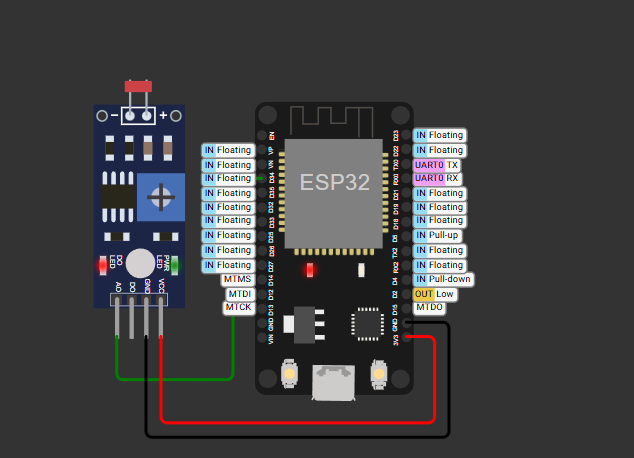
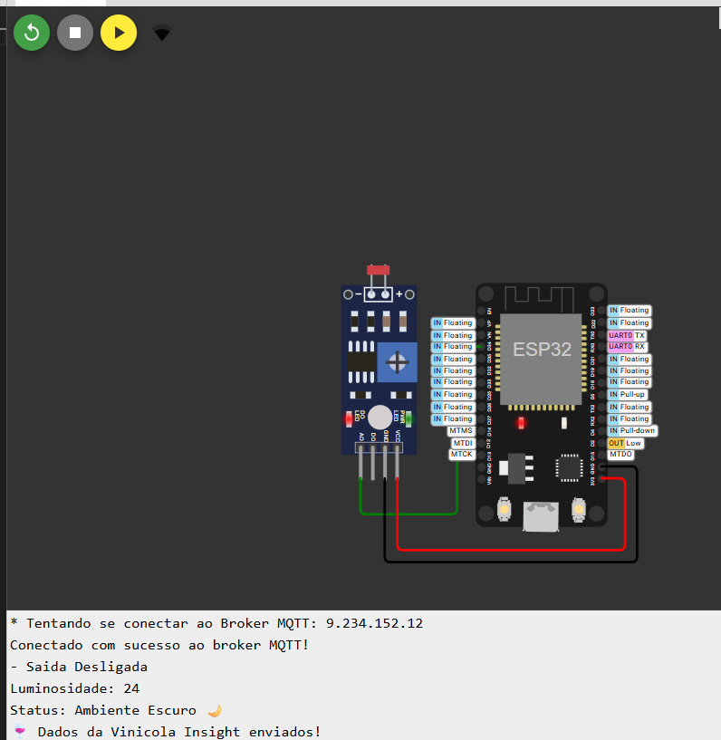

# InsightEdge - Projeto FIWARE e Ubuntu Linux

## Integrantes do Grupo:

* Bruno Scuciato (RM: 562159)
* Gabriel Inague (RM: 561985)
* Kelwin Silva (RM: 566348)
* Luiz Balbino (RM: 566222)
* Pedro Almeida (RM: 564711)

---

## Introdução

Este projeto explora a integração entre o sistema operacional **Ubuntu Linux** e a plataforma **FIWARE**, com foco em soluções de Internet das Coisas (IoT). O objetivo é demonstrar como dispositivos podem ser conectados e seus dados gerenciados e contextualizados utilizando as ferramentas e padrões oferecidos pela FIWARE, rodando em um ambiente Linux robusto como o Ubuntu.

O fluxo do projeto inclui:

* Um dispositivo **ESP32** que monitora a luminosidade e interage com um broker MQTT.
* A plataforma **FIWARE** (Orion Context Broker e IoT Agent) rodando em um ambiente Docker no Ubuntu Linux.
* Uma coleção **Postman** para configurar e interagir com os componentes FIWARE.

---

## Visão Geral do Hardware e da Conexão

Para este projeto, utilizamos um **ESP32** conectado a um sensor de luminosidade **LDR**. A imagem abaixo mostra o diagrama de conexão, que pode ser simulado e testado através do projeto no Wokwi.

* **VCC:** Conectado ao pino 3V3 do ESP32
* **GND:** Conectado ao pino GND do ESP32
* **A0 (Analógico):** Conectado ao pino GPIO34 do ESP32

Para simular o funcionamento do circuito antes de montar o hardware físico, você pode acessar o projeto Wokwi:
[https://wokwi.com/projects/441381648455931905](https://wokwi.com/projects/441381648455931905)

---

## Exemplo de Saída Serial

A imagem abaixo mostra a saída do **Monitor Serial** do ESP32, exibindo o estado do sistema, o valor de luminosidade lido pelo sensor e a comunicação com o broker MQTT.

---

## Componentes da Solução

### Ubuntu Linux
(Aqui você pode manter o texto sobre a escolha do Ubuntu e por que ele é ideal para o projeto.)

### FIWARE
(Aqui você pode manter a seção sobre os componentes FIWARE, como Orion Context Broker e IoT Agents.)

### Análise do Código e Coleção Postman
(Aqui você pode manter as seções detalhadas sobre o código do dispositivo e a coleção Postman.)

---

## Arquitetura e Fluxo de Dados
(Mantenha a seção atual que explica o fluxo de dados.)

---

## Configuração e Instalação
(Mantenha a seção atual com os pré-requisitos e os passos para a configuração.)

---

## Conclusão
(Mantenha a seção de conclusão.)

---

## Referências
(Mantenha as referências existentes e adicione o link do Wokwi aqui também, se desejar.)
